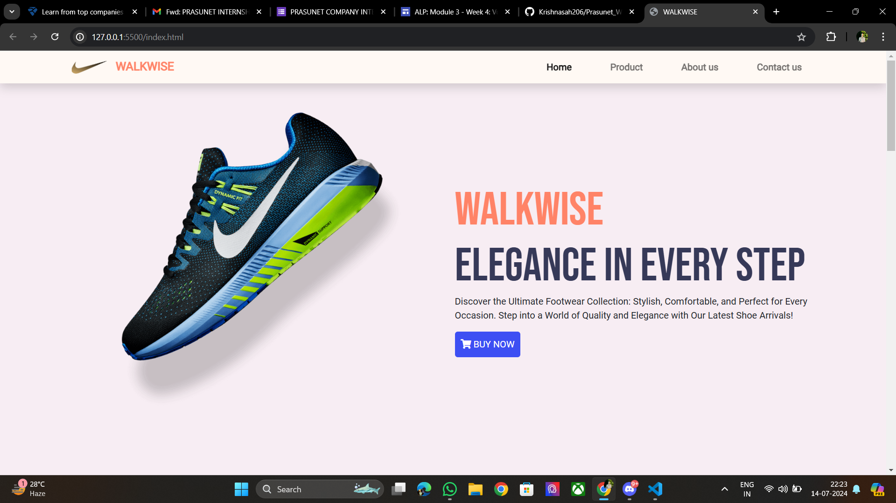
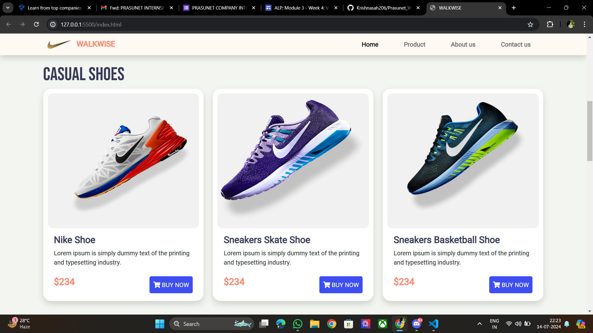
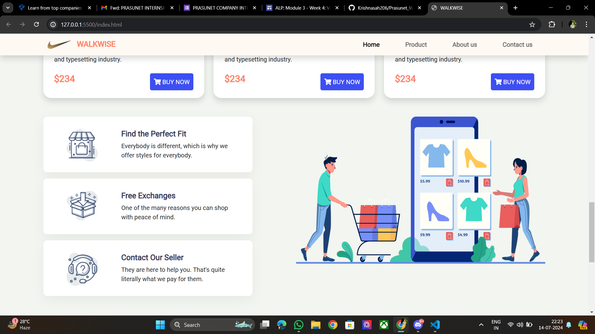
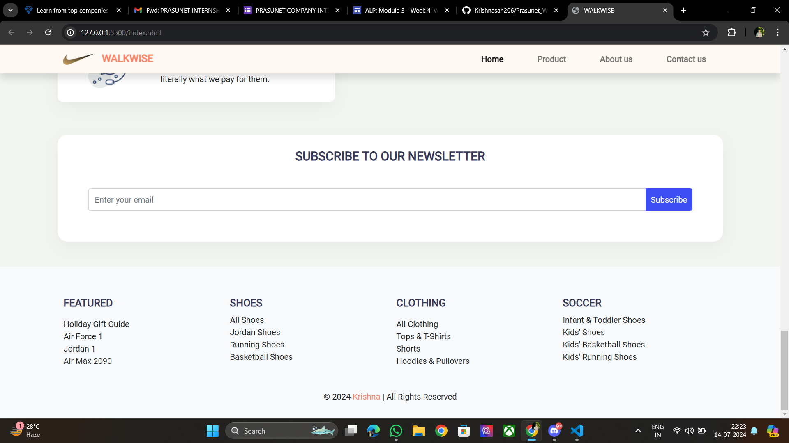

## Walkwise 

This project is a responsive landing page for the Walkwise Shoes website, designed using HTML, CSS, and JavaScript. The landing page adapts seamlessly to various screen sizes, providing an optimal viewing experience on desktops, tablets, and mobile devices.

### Features

- **Responsive Design**: The website is built to ensure it looks great on all devices, including desktops, tablets, and smartphones. This is achieved using CSS media queries, which adjust the layout and styling based on the screen size and resolution.
  
- **Modern Layout**: The design follows a clean and modern aesthetic, with a focus on showcasing the shoes in an appealing manner. This includes a hero section with a featured product, product showcases, and call-to-action buttons.
  
- **Interactive Elements**: JavaScript is used to add interactivity to the page. This includes features such as a navigation menu that toggles on smaller screens, image sliders to showcase different products, and smooth scrolling for a better user experience.
  
- **Navigation Bar**: A fixed navigation bar allows users to easily navigate through different sections of the page. On smaller screens, the navigation bar transforms into a hamburger menu to save space and enhance usability.
  
- **Hero Section**: The hero section includes a large background image, a catchy headline, and a call-to-action button, designed to capture the user's attention immediately upon landing on the page.
  
- **Product Showcase**: This section highlights the key products offered by Walkwise, with images, descriptions, and prices. The layout adjusts to display products in a grid or a single column based on the screen size.
  
- **Footer**: The footer contains links to social media, contact information, and additional navigation options. It is styled to remain consistent with the overall design of the website and ensures all essential information is easily accessible.

### Technologies Used

- **HTML**: Provides the basic structure of the webpage, including the layout of different sections such as the header, hero section, product showcase, and footer.
  
- **CSS**: Used for styling the webpage, ensuring a consistent look and feel. CSS media queries are extensively used to adjust the layout and design based on different screen sizes.
  
- **JavaScript**: Adds dynamic behavior to the webpage. This includes event listeners for the navigation menu, functionality for the image slider, and smooth scrolling effects.

### How to View the Project

1. **Clone the Repository**: Clone the GitHub repository to your local machine using `git clone`.
2. **Open in Browser**: Navigate to the project directory and open the `index.html` file in your preferred web browser.
3. **Responsive Testing**: Resize the browser window or open the developer tools to simulate different device screen sizes and see how the landing page adapts.

